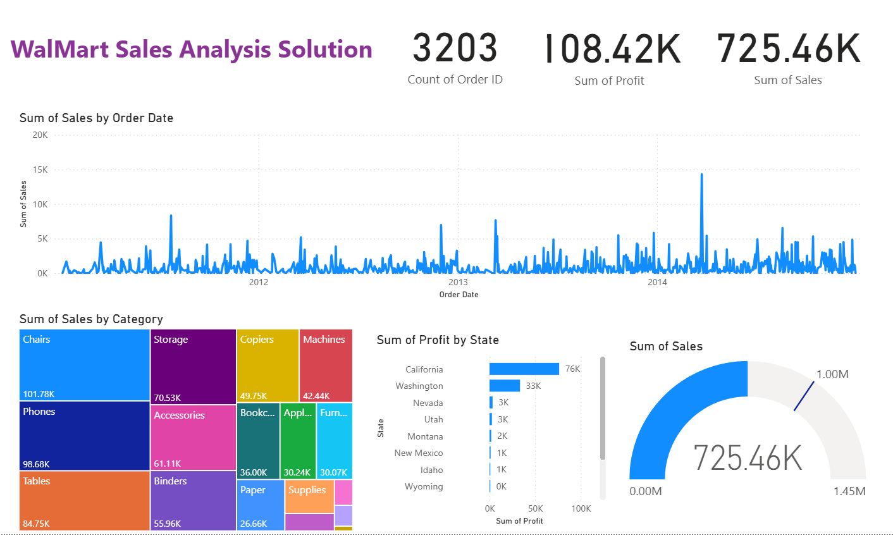

# 🛒 Walmart Sales Analysis Dashboard

## 📌 Project Overview

This Power BI project analyzes Walmart sales data to uncover trends in revenue, profit, customer purchasing behavior, and product performance.

The dashboard provides interactive visualizations that help stakeholders monitor business performance and make data-driven decisions.

---

## 🎯 Business Objectives

The dashboard answers key business questions:

- What are the overall sales and profit trends?
- Which product categories generate the highest revenue?
- Which regions perform best?
- What are the top-selling products?
- How do sales vary across months and years?
- Which customer segments contribute most to sales?

---

## 📊 Dashboard Features

### Executive Dashboard
- Total Sales
- Total Profit
- Total Orders
- Profit Margin
- Sales Growth Trends

### Product Analysis
- Sales by Category
- Sales by Sub-Category
- Top Performing Products
- Product Contribution Analysis

### Regional Analysis
- Sales by Region
- Profit by Region
- State-wise Performance

### Time Analysis
- Monthly Sales Trends
- Year-over-Year Performance
- Seasonal Sales Patterns

---

## 🛠️ Tools & Technologies

- Power BI Desktop
- Power Query
- DAX (Data Analysis Expressions)
- Data Modeling
- Data Visualization
- Business Intelligence

---

## 📂 Dataset Information

The dataset includes:

### Orders
- Order ID
- Order Date
- Ship Date
- Customer Information
- Product Information
- Sales
- Quantity
- Profit

### Customers
- Customer Name
- Segment
- Region
- State
- City

### Products
- Product Name
- Category
- Sub-Category

---

## 🔄 Data Preparation

The following transformations were performed:

- Data Cleaning
- Handling Missing Values
- Data Type Corrections
- Relationship Creation
- Calculated Measures using DAX
- KPI Development

---

## 📈 Key Performance Indicators (KPIs)

- Total Sales
- Total Profit
- Total Orders
- Average Order Value
- Profit Margin %
- Sales Growth %

---

## 💡 Insights Generated

- Identified highest revenue-generating categories.
- Analyzed regional sales performance.
- Evaluated profitability across products.
- Tracked monthly and yearly growth trends.
- Highlighted top-performing products and customer segments.

---

## 📷 Dashboard Preview

### Overview Dashboard

Add screenshots here:

## 🚀 Skills Demonstrated

- Power BI Dashboard Development
- Data Modeling
- DAX Calculations
- Business Intelligence
- Data Visualization
- KPI Reporting
- Sales Analytics

